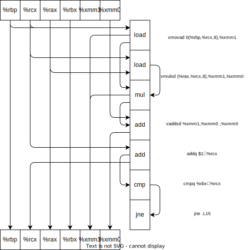
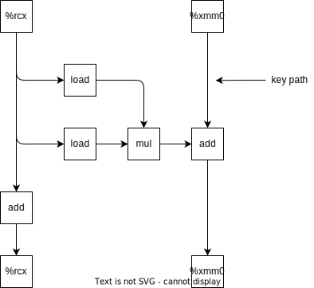

<center><h1>Homework3</h1></center>

<center>BY  唐志鹏  SA23011068</center>

## 5.13

- A

  

  

- B：决定的 CPE 的下界是 sum 的浮点加法

- C：对于整数代码，决定 CPE 的下界是 sum 的整数加法

- D：关键路径上只有浮点加法，浮点乘法可以并行执行

## 5.17

```c
void* basic_memset(void *s, int c, size_t n)
{
    size_t K = sizeof(unsigned long);
    size_t cnt = 0;
    long endsize = 0;
    unsigned char cchar = c;
    unsigned long clong = 0;
    unsigned char *strans = s;
    int i;
    for(i=0; i<K; i++) {
        clong |= cchar << i;
    }
    while(strans % K !=0) {
        *strans++ = cchar;
        cnt++;
    }
    endsize = cnt % K;
    strans = (unsigned long *) strans;
    while(cnt<n-endsize) {
        *strans++ = clong;
        cnt += 8;
    }
    strans = (unsigned char *) strans;
    while(cnt<n) {
        *strans++ = cchar;
        cnt++;
    }
    return s;
}
```

## 6.25

- 高速缓存大小 $C=B\times E\times S$
- $b=\log_2(B)，s=\log_2(S)$
- $t=m-s-b$

| 高速缓存 | m    | C    | B    | E    | S    | t    | s    | b    |
| -------- | ---- | ---- | ---- | ---- | ---- | ---- | ---- | ---- |
| 1        | 32   | 1024 | 4    | 4    | 64   | 24   | 6    | 2    |
| 2        | 32   | 1024 | 4    | 256  | 1    | 30   | 0    | 2    |
| 3        | 32   | 1024 | 8    | 1    | 128  | 22   | 7    | 3    |
| 4        | 32   | 1024 | 8    | 128  | 1    | 29   | 0    | 3    |
| 5        | 32   | 1024 | 32   | 1    | 32   | 22   | 5    | 5    |
| 6        | 32   | 1024 | 32   | 4    | 8    | 24   | 3    | 5    |

## 6.29

- A
    - 块偏移 CO：0~1
    - 组索引 CI：2~3
    - 标记 CT：4~11
- B
    - 读 0x834，块偏移 0b00，组索引 0b01，标记位 0x83，这一行有效位是 0，不命中。
    - 写 0x836，块偏移 0b10，组索引 0b01，标记位 0x83，这一行有效位是 1（上一步把这一个块读进来了），命中。
    - 读 0xFFD，块偏移 0b01，组索引 0b11，标记位 0xFF，这一行有效位是 1，命中 C0。

## 6.34

- 一个块 16 字节，总共 32 个字节，说明有两个组。
    - 块偏移：0~3
    - 组索引：4
    - 一个块能存储 4 个 int
    - src 的前一半和后一半、dst 的前一半和后一半，四个部分是冲突的

src

| m    | m    | h    | m    |
| ---- | ---- | ---- | ---- |
| m    | h    | m    | h    |
| m    | m    | h    | m    |
| m    | h    | m    | h    |


dst

| m    | m    | m    | m    |
| ---- | ---- | ---- | ---- |
| m    | m    | m    | m    |
| m    | m    | m    | m    |
| m    | m    | m    | m    |

## 6.38

- 块大小 32 字节，位偏移是 5 位，能存 8 个 int，能存 2 个 point_color 结构体
- 直接缓存的大小为 2048 字节，也就是有 64 个组，组索引是 6 位
- A：写总数是 $16\times 16\times 4=1024$
- B：访问顺序是先行后列，那么除了冷不命中都能命中，读第一个结构体的第一个int的时候，就把两个结构体都读入到块里的，不命中的写总数是 128
- C：不命中率是 12.5%

## 6.41

- 每行 4 个字节，位偏移是 2 位。有 16384（$2^{14}$）个组，组索引 14 位
- 访问方式是先列再行，一行有 3840 个字节。[0,0] 进的组索引是 0b00000000000000，[1,0] 进的组索引是 0b00001111000000。看高 8 位，其实就是 512*m=15*n，n 最小是 512，这个值是大于 480 的，所以不会冲突
- 只存在冷不命中，对第一个 r 的写不命中，对 g、b、a 的写命中，不命中率是 25%